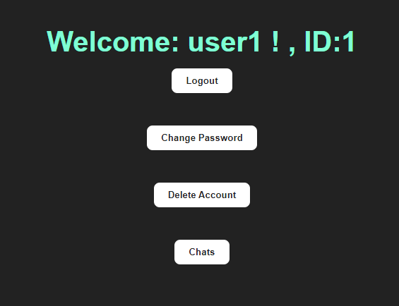

# Chat AI Flask + React + Mysql

Chat AI Flask + React + Mysql , with Flask REST API with sqlalchemy mysql where there is a login and registration and also you can login and register with google where each user can create chats to interact with artificial intelligence, in this case artificial intelligence is not implemented, but all the operation that I think is done at the time of implementing chats with AI is implemented, this saving the chats in databases where each user can delete and create chats at any time.

  

___

First create an account where you must create a username, password ("Must include at least one number.", "Must include at least one lowercase letter,"Must include at least one lowercase letter.", "Must include at least one uppercase letter.", "Must include at least one uppercase letter.","Must include at least one uppercase letter.", "Must include at least one uppercase letter.", "Must include at least one uppercase letter.","Must include at least one special character.", "Must include at least one special character.", "Must include at least one special character.","The length of the password must be equal to or greater than 8 characters.","Must not contain blank spaces.") Confirm your password and enter an email address ;You can also register with google .

  

In login enter your username and password, click on the "Login" button.You can also login  with google (but you must register with google first).

  

After logging in you will see the home screen where you will see your user name and registration id, in this section you can log out, change your password, delete your account (delete your account and chats), and Chats.

  

In change password you can change your password and email if required.

  

  

When you click on the "Chats" button (a table is created with the user), it shows an interface where you can create chats and where you can ask the artificial intelligence.

  

  

When you enter a name to create the chat and click on the "Create chat" button (you create a table with the user and the name of the chat) the chat is created with the name provided. 

  

  

  

  

Once you have created your chat, you can enter in your input, your request to the IA (always remember to select the chat where you want to send the input).

  

In this case the AI response is random characters, but can be replaced using the chatgpt API or your own AI.You can also delete the chat if you wish.

---

## Using google API

Using google API modify this with your "clientId", your "clientId" is in https://console.cloud.google.com/ if you don't know how to use it here  is an  [example](https://www.youtube.com/watch?v=HtJKUQXmtok) 

Modify : "CLIENT_ID_APPIGOOLE" in Login.jsx  and Loginup.jsx

  

  

In this case with flask and React in https://console.cloud.google.com/ put this way.

  

